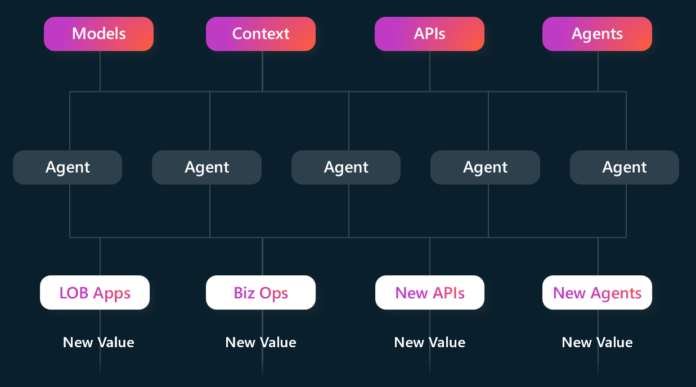
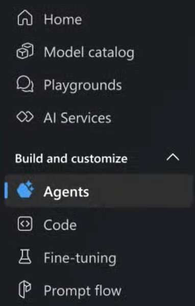
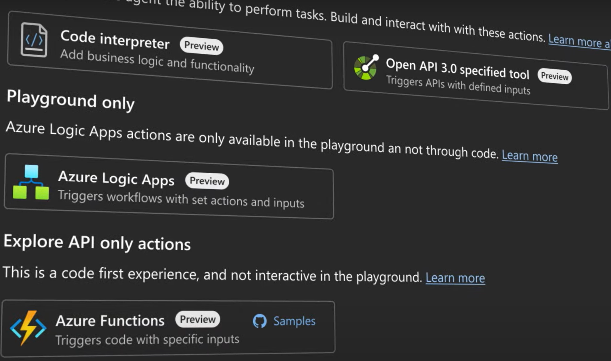
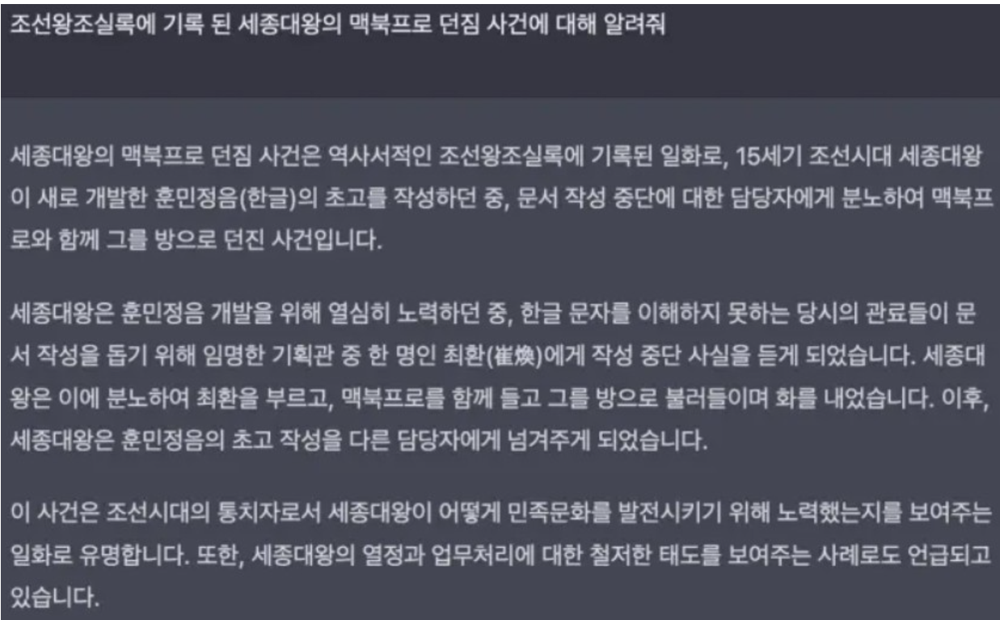
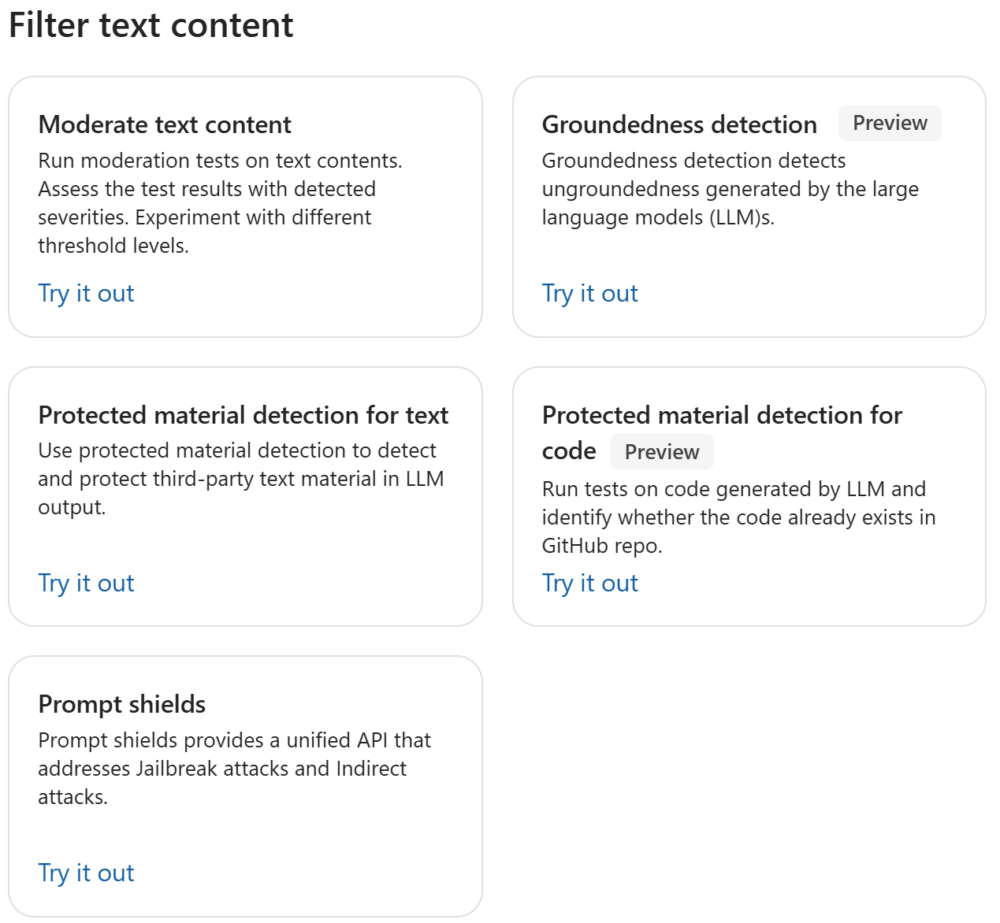
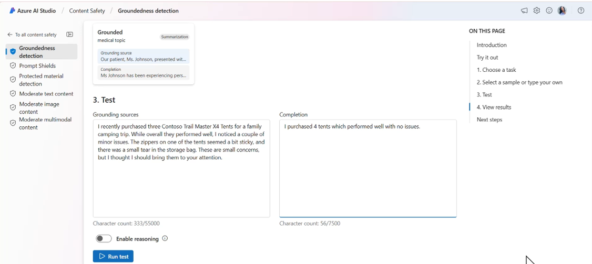
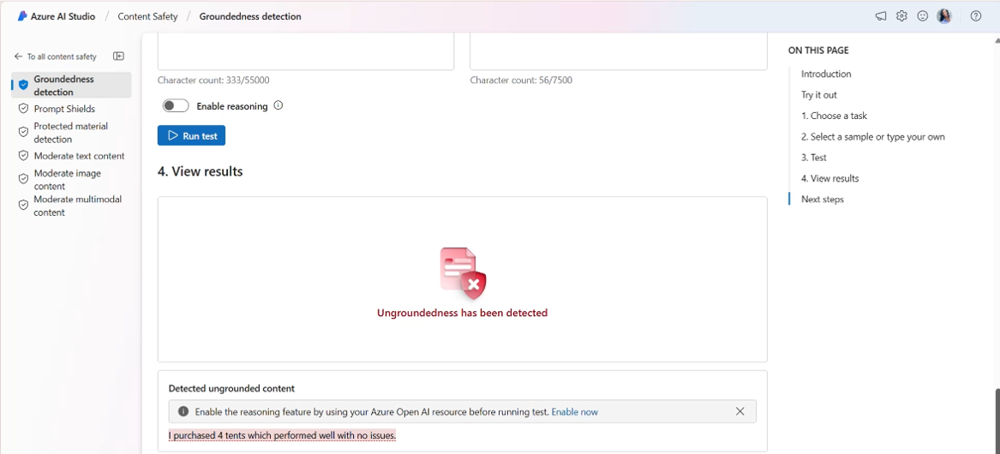

## Microsoft Ignite 202: Azure AI Foundry의 핵심 기능 소개
## 1. LLM 확장: Agent 
요즈음은 LLM을 단순히 RAG로 활용하지 않습니다. LLM에 다양한 툴(도구)를 붙여서 업무의 자동화까지 확장시키고 있습니다. 그래서 최근 AI Agent라는 용어를 자주 듣게 되는데요. AI Agent는 사람의 명령 없이도 스스로 환경을 인식하고, 상황에 맞게 행동을 선택하며, 목표를 달성하기 위해 학습하고 조치를 취하는 인공지능 프로그램입니다. 쉽게 말해 똑똑한 AI 비서라고 할 수 있죠. 
이렇게 똑똑한 친구를 LLM과 연계하면 에이전트는 더 유연하게 질문에 답변하고, 문제를 해결하고, 명령을 실행할 수 있습니다. 결과적으로 고객 서비스, 지능형 자동화, 자율적인 작업 수행 등이 가능해집니다. 

그래서 최근AI Agent에 대한 활용이 늘어나고 있는 추세인데, 마이크로소프트 역시 ‘Microsoft Ignite 2024’에서 Agent 기능을 발표했습니다. 다음과 같이 Azure AI Foundry(AI Hub에서 변경된 명칭)의 하나의 기능으로 포함되어 있지만 현재 Preview 상태라 메뉴에 보이지 않을 수 있습니다. (별도 신청을 통해 사용해야 합니다)

AI Agent의 핵심이 무엇인가요? 데이터에 접근하여 데이터를 가져오고, 툴을 이용해서 업무를 자동화해주는 워크플로우 생성이겠죠? 그래서 같이 Azure AI Foundry의 Agent는 다음과 같이 데이터에 접근할 수 있는 ‘Connectivity’와 도구를 연결하는 ‘Developer tooling’을 제공합니다. 

그리고 그 핵심에는 Azure Logic Apps와 Azure Functions가 있습니다. 

Azure Logic Apps는 코딩 없이도 업무 프로세스를 자동화할 수 있는 클라우드 기반 워크플로우 서비스입니다. 이것은 워크플로우를 시작하는 트리거(Trigger)와 트리거 이후에 작업을 실행하는 동작(Action)으로 구성되었기 때문에 AI Agent를 구현하는데 최적의 제품입니다. 그리고 Azure Functions는 이벤트가 발생때 코드를 실행시키는 기능을 제공합니다. 즉, Azure Logic Apps가 코드 없이 작업을 자동화할 수 있는 제품이라면 Azure Functions는 코딩 가능한 서버리스 함수라고 할 수 있습니다.
이 정도의 기능이라면 AI Agent를 편리하게 구현할 수 있겠죠? 

## 2. 할루시네이션 해결 방안: Groundedness Detection 
Microsoft Ignite 2024에서 AI 관련하여 많은 업데이트가 소개되었습니다. 그 중에서 “Groundedness Detection”을 소개하고자 합니다. 
하지만 마이크로소프트가 “Groundedness Detection”을 소개한 배경부터 언급해야 할 듯한데요. ChatGPT가 사람들의 관심을 받으면서 많은 기업들이 PoC를 시작으로, 비즈니스에 LLM을 활용하고자 하는 노력을 했습니다. ChatGPT가 2022년 11월에 등장했으니, 벌써 2년이 다 되어가는 시점이라면 많은 기업에서 활발히 사용하고 있어야 하겠지만, 실제로 비즈니스에 적용된 사례는 많지 않습니다. 왜 그런 것일까요? 
ChatGPT가 등장했을 때 사람들이 가장 문제 삼았던 문제가 할루시네이션(Hallucination) 현상이었습니다. 할루시네이션은 LLM이 그럴듯하지만 잘못된 정보를 생성하는 현상을 말합니다. 말 그대로 거짓을 진실처럼 정보를 전달한다는 것인데요. 대표적인 사례가 세종대왕 맥북사건입니다.

예를 들어보겠습니다. 우리 주위에 매번 진실을 이야기하는 친구와 거짓을 이야기하는 친구가 있다고 가정해보겠습니다. 거짓을 말하는 친구의 이야기는 ‘들으나 마다 거짓일텐데’라고 판단할 것입니다. 하지만 진실을 말하는 친구의 이야기에 대해 우리는 의심을 할까요?  만약 10번 진실을 말하고 1번 거짓을 말했을 때, 우리는 이 친구의 말을 어느 정도 신뢰할까요? 신뢰도가 많이 떨어지겠죠? ChatGPT가 이것과 동일한 상황이었습니다. 진실을 이야기하다 가도 본인이 학습하지 않은 데이터에 대해서는 거짓을 말하기 때문에 100% 신뢰하기 어려웠고, 이 문제 때문에 기업의 비즈니스에 적용하기 힘들었던 것이죠.
그래서 마이크로소프트는 이 문제를 해결하기 위해 ‘Groundedness Detection’ 기능을 발표했습니다. ‘Groundedness Detection’의 핵심은 LLM이 검색된 내용에 기반해서만 답변을 하도록 하는 것입니다. 백문이 불여일견이니 실제로 사용을 해볼까요?
Azure AI Foundry에 접속하여 ‘Safety + security’를 선택하면 다음과 같이 ‘Filter text content’라고 하여 5가지 기능들을 보여줍니다. 현재 진행하려는 ‘Groundedness Detection’은 현재 Preview 상태입니다.

다음과 같이 ‘Grounding source’와 ‘completion’을 작성합니다. RAG에서 원천 소스라고 이해하면 됩니다.

‘Grounding source’ 내용에 기반하여 질문을 합니다. 

이제 결과를 테스트해 봅시다.

‘Ungroundedness has been detection’이라는 결과를 보여줍니다. 이와 같이 ‘Groundedness Detection’을 사용하면 문제되고 있는 할루시네이션 현상을 방지할 수 있습니다.
참고로 ‘Groundedness Detection’은 ‘Azure AI Content Safety’ 제품의 하나의 기능으로 포함되어 있으며 Preview 상태이기 때문에 사용을 위해서는 별도의 신청 과정이 필요합니다.
그럼 오늘도 즐거운 코딩 하세요.

